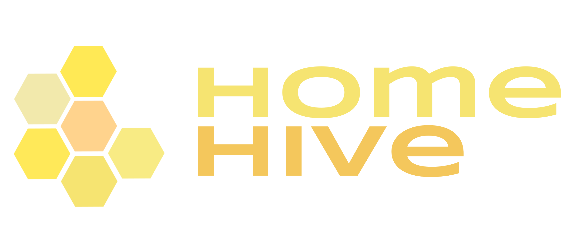

# HomeHive
The HomeHive is a revolutionary smart-home assistant device and is designed to improve
your productivity. It could be mounted on the wall, built into another appliance, and could
be detached into a portable tablet device. Built using the Raspberry Pi, its internet
connectivity allows you to integrate into your calendar to give you reminders of upcoming
events. Its proprietary and groundbreaking smarthome alarm clock technology allows you
to set timers & alarms, automatically playing the latest news, tell you the weather or play
your favourite tunes whenever you wake up.

- [Bitbucket](https://repo.csd.uwo.ca/projects/COMPSCI3307_W2023/repos/group4/browse)
- [Confluence](https://wiki.csd.uwo.ca/display/COMPSCI3307W2023GROUP4)
- [Jira](https://jira.csd.uwo.ca/projects/COMPSCI3307W2023GROUP4/summary)

----


## Features
- [x] GUI Application
- [x] Dynamic backgrounds (via Unsplash)
- [x] Current date & time
- [x] User greeting message
- [x] Settings menu
- [x] Alarm clock
- [x] Weather forecast
- [x] Latest news

### Planned Features
- [ ] Calendar integration
- [ ] Spotify integration
- [ ] Text-to-speech (maybe?)

----


## Installation
To begin the installation process, it's best to ensure you meet these requirements:
```
Linux 5.4+ with a desktop environment that supports GTK 3.x (eg: KDE, Gnome)
CMake 3.10+ with C++11 support
libcurl (with dev headers)
Stable internet connection
LibSDL2 (with dev headers for sound)
```

You can check if these are installed and their versions with these commands:
```bash
#linux version
uname -a

#versions for GTK libcurl and glib respectively
pkg-config --modversion gtk+-3.0 libcurl glib-2.0

#get cmake version
cmake --version
```

You might need to install some of these dependencies, depending on your distro, an example
(tested on my RPI 2b):
```bash
sudo apt install cmake libcurl4-openssl-dev libgtk-3-dev libglib2.0-dev libsdl2-dev
```

If those seem reasonably within the requirements and are installed (which it probably should be if you're
using some desktop Linux distro), then you can proceed to the next step.

**1. Clone the repository**
```bash
# prefer using SSH, more secure. make sure you've registered your SSH key with Bitbucket
git clone ssh://git@repo.csd.uwo.ca:7999/compsci3307_w2023/group4.git HomeHive

# alternatively, using HTTP
git clone https://repo.csd.uwo.ca/scm/compsci3307_w2023/group4.git HomeHive

# then enter that directory
cd HomeHive
```

**2. Generate CMake**
This project uses CMake to build the project, especially since it's default and seems to integrate perfectly
with CLion. But you can generate the CMake files with the following command, in the root directory:

```bash
cmake -G "Unix Makefiles" -DCMAKE_BUILD_TYPE=Debug -B cmake-build-debug
```

Allow for some time to generate the files. CMake will also download the JSON library as a dependency from Github.
This will create a new folder `cmake-build-debug` which will contain the build files and CMake cache.

----


## Building
Once the CMake files have been generated, you can build the project with the following command:

```bash
# build using CMake
cmake --build cmake-build-debug --target HomeHive -- -j 4

# or build using the generated Makefile
make -C cmake-build-debug -j 4 HomeHive
```

Once built you can run the program in CLI:
```bash
./cmake-build-debug/HomeHive &
```

### Build all targets
If you want to build all the targets, such as any of the test CLI executables for prototyping, or
testing some functionality without the entire GUI GTK stack, you can use the following command:

```bash
# build using CMake
cmake --build cmake-build-debug -- -j 4

# or build using the generated Makefile
make -C cmake-build-debug -j 4
```

----
### Build & Install Scheme files
to compile and install scheme files these bash commands can help
```bash
glib-compile-schemas .
sudo glib-compile-schemas . --targetdir /usr/share/glib-2.0/schemas/
```

## Development
Development is done by using branches `feature/name` or `bugfix/name` and then merging into `master`,
preferably using a pull request to be reviewed first.

### Resources
- [GTK 3.0 Reference Manual](https://docs.gtk.org/gtk3/)
- [CMake Documentation](https://cmake.org/cmake/help/latest/)
- [JSON for Modern C++](https://json.nlohmann.me/)
- [Unsplash API](https://unsplash.com/documentation)
- [Libcurl](https://curl.se/libcurl/c/)

### Project Structure
```
/                   # root directory
/event              # various event-related and timers
/gui                # GUI-related code
/request            # HTTP/API related code
/resources          # resources such as images, icons, styles, etc
```
